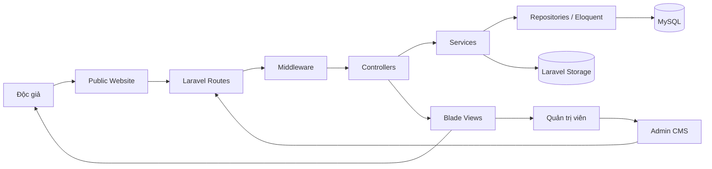

# Phân tích hệ thống và thiết kế kiến trúc Laravel

> Hạng mục: Phân tích hệ thống, khảo sát hệ thống CodeIgniter cũ và thiết kế kiến trúc Laravel  
> Phiên bản tài liệu: 1.0

## 1. Mục tiêu

Hạng mục này xác lập kiến trúc cho VCA Portal CMS, một hệ thống quản trị nội dung và cổng thông tin điện tử của Liên minh Hợp tác xã Việt Nam. Kiến trúc mới cần:

- Thay thế nền tảng CodeIgniter cũ bằng Laravel.
- Quản lý tập trung bài viết, trang tĩnh, chuyên mục, văn bản, cơ quan ban hành, media, thư viện ảnh và widget.
- Cung cấp Admin CMS có xác thực và Public Website cho độc giả.
- Bảo toàn khả năng truy cập nội dung cũ trong quá trình chuyển đổi.
- Hỗ trợ nội dung tiếng Việt và tiếng Anh.
- Dễ phát triển, kiểm thử, vận hành và mở rộng theo Laravel convention.

## 2. Phạm vi nghiệp vụ

### 2.1. Nhóm người dùng

| Nhóm | Nhu cầu chính |
| --- | --- |
| Độc giả | Xem tin tức, trang thông tin, văn bản, thư viện ảnh và tải tài liệu |
| Quản trị viên/biên tập viên | Đăng nhập CMS, tạo và quản lý nội dung, media, tài khoản và cấu hình hiển thị |
| Đơn vị vận hành | Triển khai phiên bản, theo dõi lỗi, sao lưu dữ liệu và hỗ trợ người dùng |

### 2.2. Khu vực chức năng

Hệ thống được chia thành hai khu vực:

- **Admin CMS** tại prefix `/admin`: quản trị nội dung, media, tài khoản và dashboard.
- **Public Website** tại domain chính hoặc subdomain ngôn ngữ: hiển thị nội dung đã xuất bản.

Các module chính hiện có:

| Module | Vai trò |
| --- | --- |
| `User` | Tài khoản đăng nhập và thông tin người quản trị |
| `Category` | Cây chuyên mục cho bài viết, văn bản và thư viện ảnh |
| `Post` | Tin tức và bài viết |
| `Page` | Trang tĩnh |
| `Document` | Văn bản và file tải về |
| `IssuingAgency` | Cơ quan ban hành văn bản |
| `Media` | Thư viện file dùng chung |
| `Gallery` | Album và thư viện ảnh |
| `Widget` | Nội dung phụ trợ theo vị trí trên trang chủ |

## 3. Quyết định kiến trúc

Hệ thống sử dụng **Laravel monolith, Blade-first**. Admin CMS và Public Website dùng chung một ứng dụng, một domain model và một tầng dữ liệu.



Lý do lựa chọn:

- Phù hợp với bài toán CMS và cổng thông tin server-side rendering.
- Không phát sinh chi phí vận hành hai ứng dụng frontend/backend độc lập.
- Eloquent, Form Request, Storage, authentication và testing được dùng thống nhất.
- Blade kết hợp Tailwind CSS và Alpine.js đáp ứng dashboard và website responsive mà không cần SPA framework.
- Có thể bổ sung API versioned khi xuất hiện nhu cầu tích hợp bên thứ ba.

Quyết định này được ghi nhận trong `docs/project/adr/0001-laravel-monolith.md`.

## 4. Kiến trúc logic

### 4.1. Luồng CRUD quản trị

```text
Browser
  -> routes/admin.php
  -> web + auth middleware
  -> Admin Controller
  -> Form Request
  -> Service
  -> Repository / Eloquent Model
  -> Database hoặc Laravel Storage
  -> Redirect + flash message hoặc JSON response
```

Controller điều phối request/response. Form Request chịu trách nhiệm validation. Service xử lý nghiệp vụ nhiều bước. Repository gom truy vấn lọc, tìm kiếm, phân trang và persistence. Model khai báo relationship, cast, scope và accessor.

### 4.2. Luồng Public Website

```text
Browser
  -> routes/web.php
  -> Public Controller
  -> Public Service
  -> Repository / published scope
  -> Blade View
  -> HTML response
```

Public query lọc nội dung theo:

- `status = published`.
- `published_at` không vượt quá thời điểm hiện tại.
- `locale` xác định từ hostname.
- Điều kiện chuyên mục hoặc nhóm văn bản tương ứng.

### 4.3. Luồng Media

```text
Admin upload
  -> StoreMediaRequest
  -> MediaService
  -> storage/app/public/media/YYYY/MM/{uuid}.{extension}
  -> media metadata record
  -> Media Picker / module tham chiếu media_id
```

Tên file vật lý dùng UUID để tránh trùng và hạn chế phụ thuộc tên file gốc. Database lưu metadata gồm MIME type, extension, dung lượng, kích thước ảnh, tiêu đề, alt text và caption.

## 5. Kiến trúc mã nguồn

| Thành phần | Vị trí |
| --- | --- |
| Route công khai | `routes/web.php` |
| Route quản trị | `routes/admin.php` |
| Controller quản trị | `app/Http/Controllers/Admin` |
| Controller công khai | `app/Http/Controllers/PublicSite` |
| Validation | `app/Http/Requests/Admin` |
| Service nghiệp vụ | `app/Services` |
| Service public | `app/Services/PublicSite` |
| Repository | `app/Repositories` |
| Eloquent Model | `app/Models` |
| Enum | `app/Enums` |
| Admin Blade | `resources/views/admin` |
| Public Blade | `resources/views/public` |
| Component dùng chung | `resources/views/components` |
| Database migration | `database/migrations` |
| Automated test | `tests/Feature`, `tests/Unit` |

## 6. Công nghệ sử dụng

| Lớp | Công nghệ thực tế |
| --- | --- |
| Runtime | PHP `^8.3` |
| Framework | Laravel `^13.8` |
| ORM | Eloquent |
| Template | Blade |
| CSS | Tailwind CSS 4 |
| Tương tác UI | Alpine.js 3 |
| Build tool | Vite 8 |
| Rich text | TipTap 3 |
| Slider | Splide 4 |
| Icon | Lucide |
| Date/time picker | Flatpickr |
| Test | PHPUnit 12 |
| Database local | MySQL |
| File storage | Laravel Storage, disk `public` cho media |

## 7. Đa ngôn ngữ

Thiết kế nội dung đa ngôn ngữ sử dụng record riêng:

- `locale = vi`: nội dung tiếng Việt.
- `locale = en`: nội dung tiếng Anh.
- `translation_key`: liên kết các phiên bản ngôn ngữ của cùng một nội dung.
- Public Website xác định locale từ hostname; hostname bắt đầu bằng `en.` sử dụng locale `en`, còn lại dùng `vi`.
- Slug được quản lý trong phạm vi locale và loại nội dung.

Mô hình này tránh phụ thuộc package dịch ngoài và cho phép mỗi ngôn ngữ có tiêu đề, slug, nội dung và metadata độc lập.

## 8. Khả năng tương thích dữ liệu cũ

Kiến trúc mới giữ các trường fallback phục vụ dữ liệu CodeIgniter:

| Dữ liệu | Trường tương thích |
| --- | --- |
| Ảnh đại diện bài viết | `posts.legacy_thumbnail_path` |
| File văn bản | `documents.legacy_file_path` |
| Ảnh album | `galleries.legacy_image_paths` |
| Ảnh bìa chuyên mục | `categories.legacy_cover_path` |
| URL cũ | Route `/{slug}.html` và `LegacyRedirectController` |

Accessor của model ưu tiên Media mới; nếu chưa có Media record thì trả về đường dẫn legacy. Cách này cho phép chuyển đổi theo giai đoạn mà nội dung cũ vẫn hiển thị.

## 9. Yêu cầu phi chức năng

### Bảo mật

- Khu vực Admin được bảo vệ bằng middleware `auth`.
- Login tái tạo session; logout hủy session và tái tạo CSRF token.
- Form Request kiểm tra dữ liệu đầu vào.
- Nội dung rich text được xử lý qua `RichContentSanitizer`.
- Bí mật môi trường không lưu trong source control.

### Hiệu năng

- Repository áp dụng eager loading cho relationship cần hiển thị.
- Danh sách quản trị và public sử dụng pagination.
- Các cột lọc chính có index.
- Admin và Public có frontend entry riêng để hạn chế tải asset không cần thiết.

### Khả năng bảo trì

- Tách route theo khu vực.
- Tách Controller, Service và Repository theo trách nhiệm.
- Dùng PHP Enum cho trạng thái và loại dữ liệu ổn định.
- Dùng Factory và automated test cho các workflow quan trọng.

## 10. Bằng chứng đối chiếu

- Kiến trúc được mô tả trong `docs/project/architecture.md` và ADR của dự án.
- 91 route được Laravel đăng ký thành công.
- Có 9 Eloquent model nghiệp vụ, 10 repository và các service theo module.
- Có layout Blade riêng cho Admin và Public.
- Có frontend entry riêng: `resources/js/admin.js`, `resources/js/public.js`.
- Ngày 28/07/2026: 194 automated test đạt, 973 assertion đạt.
- Ngày 28/07/2026: Vite production build thành công.

## 11. Giới hạn hiện tại

- Dashboard đã có giao diện nhưng số liệu tổng hợp đang là dữ liệu khởi tạo tĩnh.
- Phân quyền chi tiết theo nhiều vai trò chưa hiện diện trong repository.
- Public API versioned cho bên thứ ba chưa được mở; hệ thống hiện ưu tiên Blade và endpoint JSON nội bộ.
- Cấu hình hạ tầng staging, credential và pipeline runner được quản lý ngoài repository.

## 12. Kết luận

Kiến trúc Laravel monolith đáp ứng đúng bản chất của một CMS tin tức và thư viện văn bản: phát triển tập trung, dễ vận hành và có đường mở rộng rõ ràng. Thiết kế đã tách biệt Admin/Public, chuẩn hóa domain, hỗ trợ đa ngôn ngữ và duy trì tương thích với dữ liệu CodeIgniter cũ.
