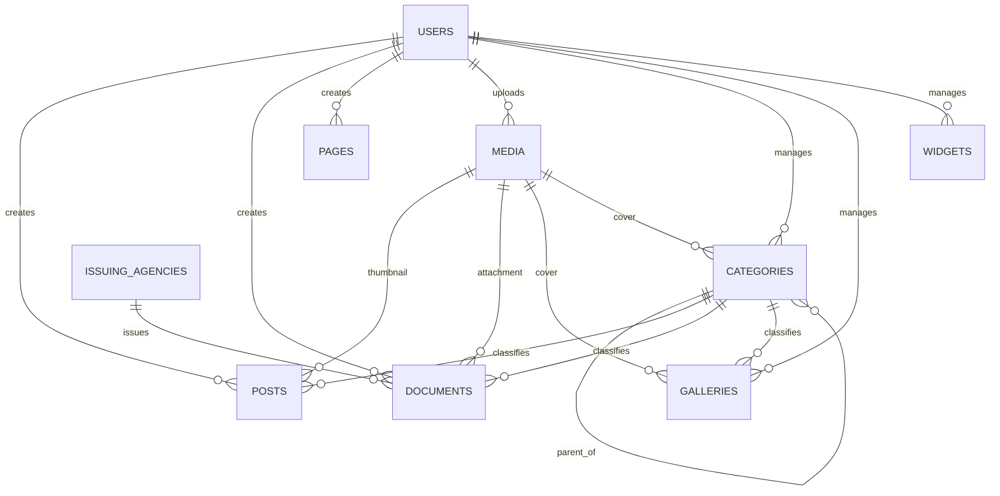

# Thiết kế Database Schema và Migration Scripts

> Hạng mục: Phân tích cơ sở dữ liệu hiện tại, thiết kế schema và xây dựng Laravel migration  
> Phiên bản tài liệu: 1.0

## 1. Mục tiêu

Thiết kế database mới cần chuẩn hóa dữ liệu từ hệ thống CodeIgniter cũ theo domain của Laravel, đồng thời:

- Tách rõ dữ liệu nội dung, danh mục, file và người dùng.
- Hỗ trợ trạng thái xuất bản và xóa mềm.
- Hỗ trợ nội dung tiếng Việt, tiếng Anh.
- Giữ thông tin tác giả và người cập nhật.
- Cho phép bảo toàn đường dẫn file legacy trong giai đoạn chuyển đổi.
- Tối ưu các truy vấn lọc, tìm kiếm, sắp xếp và phân trang.
- Quản lý mọi thay đổi schema bằng Laravel migration.

## 2. Database sử dụng

`.env.example` cấu hình kết nối local mặc định:

```text
DB_CONNECTION=mysql
DB_HOST=127.0.0.1
DB_PORT=3306
```

Tên database, username và password là cấu hình theo từng môi trường. Tài liệu không ghi credential thực tế.

Laravel vẫn hỗ trợ các driver khác trong `config/database.php`, nhưng schema và dữ liệu chuyển đổi hiện được thiết kế, kiểm thử chủ yếu theo MySQL/MariaDB.

## 3. Nhóm bảng

### 3.1. Bảng nghiệp vụ

| Bảng | Chức năng | Xóa mềm |
| --- | --- | --- |
| `users` | Tài khoản quản trị và thông tin hồ sơ | Có |
| `categories` | Chuyên mục cha/con cho post, document, gallery | Không |
| `posts` | Tin tức và bài viết | Có |
| `pages` | Trang nội dung tĩnh | Có |
| `documents` | Văn bản, metadata và file tải về | Có |
| `issuing_agencies` | Cơ quan ban hành văn bản | Có |
| `media` | Metadata file được quản lý qua Laravel Storage | Có |
| `galleries` | Album ảnh và danh sách ảnh | Có |
| `widgets` | Khối nội dung theo vị trí trên trang chủ | Có |

### 3.2. Bảng hạ tầng Laravel

| Nhóm | Bảng |
| --- | --- |
| Authentication/session | `password_reset_tokens`, `sessions` |
| Cache | `cache`, `cache_locks` |
| Queue | `jobs`, `job_batches`, `failed_jobs` |
| Migration tracking | `migrations` |

## 4. Mô hình quan hệ



Project dùng cột tham chiếu và Eloquent relationship. Theo quyết định kiến trúc hiện tại, migration mặc định không tạo database-level foreign key constraint hoặc cascade delete; hành vi xóa được kiểm soát tại ứng dụng.

## 5. Thiết kế trường dữ liệu chính

### `categories`

- Phân loại bằng `type`: `post`, `document`, `gallery`.
- Hỗ trợ cây cha/con bằng `parent_id`.
- Hỗ trợ đa ngôn ngữ bằng `locale`, `translation_key`.
- Có `sort_order`, `is_active`, ảnh bìa từ `cover_media_id` hoặc `legacy_cover_path`.
- Unique theo `type`, `locale`, `slug`.

### `posts`

- Nội dung chính: `title`, `sub_title`, `slug`, `excerpt`, `content`, `tags`.
- Phân loại và tác giả: `category_id`, `user_id`, `updated_by`.
- Xuất bản: `status`, `is_featured`, `published_at`, `views`.
- Media: `thumbnail_media_id`, `legacy_thumbnail_path`.
- SEO: `meta_title`, `meta_keyword`, `meta_description`.
- Đa ngôn ngữ: `locale`, `translation_key`.

### `pages`

- Nội dung: `title`, `slug`, `content`.
- Xuất bản: `status`, `published_at`.
- SEO: `meta_title`, `meta_keyword`, `meta_description`.
- Đa ngôn ngữ: `locale`, `translation_key`.

### `documents`

- Định danh: `title`, `slug`, `document_number`.
- Phân loại: `category_id`, `document_group`.
- Nghiệp vụ văn bản: `issued_date`, `date_of_validity`, `year`, `signer_name`, `issuing_agency_id`.
- File: `file_media_id`, `legacy_file_path`.
- Xuất bản và SEO: `status`, `published_at`, `meta_title`, `meta_keyword`, `meta_description`.
- Đa ngôn ngữ: `locale`, `translation_key`.

### `media`

- Lưu trữ: `disk`, `path`, `filename`, `original_name`.
- Định dạng: `mime_type`, `extension`, `size`.
- Thông tin ảnh: `width`, `height`.
- Metadata: `title`, `alt_text`, `caption`.
- Người upload: `user_id`.

Database chỉ lưu metadata; file vật lý nằm trên Laravel Storage.

### `galleries`

- Nội dung: `title`, `slug`, `excerpt`, `content`.
- Media mới: `cover_media_id`, `media_ids`.
- Ảnh cũ: `legacy_image_paths`.
- Phân loại: `category_id`.
- Xuất bản, SEO và đa ngôn ngữ tương tự các bảng nội dung khác.

### `widgets`

- Vị trí: `placement`, `slot`, `sort_order`.
- Loại hiển thị: `type`.
- Nội dung: `title`, `content`.
- Xuất bản: `status`, `published_at`.
- Ngôn ngữ: `locale`.

## 6. Quy ước dữ liệu

### Trạng thái xuất bản

Các bảng nội dung dùng chuỗi và cast sang `PublicationStatus`:

| Giá trị | Ý nghĩa |
| --- | --- |
| `draft` | Bản nháp, không hiển thị public |
| `published` | Có thể hiển thị public khi đến thời điểm xuất bản |
| `archived` | Đã lưu trữ/ẩn khỏi public |

### Đa ngôn ngữ

- Mỗi bản ngôn ngữ là một record riêng.
- `locale` lưu `vi` hoặc `en`.
- `translation_key` là UUID liên kết các bản dịch.
- Public query luôn lọc locale.

### Xóa dữ liệu

- Nội dung, user, media, gallery, widget và cơ quan ban hành dùng `deleted_at`.
- Xóa thông thường là soft delete.
- Một số module có route restore và force delete.
- Media chỉ xóa file vật lý khi force delete thành công.

## 7. Index và tối ưu truy vấn

Các nhóm cột được index:

- Cột tham chiếu: `user_id`, `updated_by`, `category_id`, `parent_id`, `*_media_id`, `issuing_agency_id`.
- Cột lọc: `locale`, `status`, `type`, `document_group`, `is_active`, `is_featured`, `year`.
- Cột sắp xếp/thời gian: `published_at`, `issued_date`, `date_of_validity`, `created_at`.
- Cột định danh: `slug`, `document_number`, `translation_key`.

Các unique index chính:

- `posts`: `locale + slug`.
- `pages`: `locale + slug`.
- `galleries`: `locale + slug`.
- `categories`: `type + locale + slug`.

Slug của `documents` được đổi sang `TEXT` để tương thích dữ liệu cũ có URL dài; sau thay đổi này slug có index riêng thay vì unique composite.

## 8. Chiến lược migration

Migration được tách thành các bước nhỏ, có thứ tự:

1. Tạo bảng hạ tầng Laravel.
2. Tạo `users`, `media`, `categories`, `posts`, `documents`, `pages`.
3. Bổ sung trường audit `updated_by`.
4. Tạo `issuing_agencies` và thay chuỗi cơ quan ban hành bằng `issuing_agency_id`.
5. Bổ sung metadata SEO và trường hồ sơ user.
6. Bổ sung trường tương thích legacy cho post và document.
7. Bổ sung tags, views, nhóm văn bản, hiệu lực và năm.
8. Tạo `galleries`, bổ sung ảnh bìa category.
9. Tạo `widgets` và vị trí slot.

Mỗi thay đổi schema được thực hiện bằng file mới trong `database/migrations`; không sửa trực tiếp database production.

## 9. Thực thi

### Khởi tạo hoặc nâng cấp database

```bash
php artisan migrate
```

Trên môi trường deployment không tương tác:

```bash
php artisan migrate --force
```

### Kiểm tra trạng thái migration

```bash
php artisan migrate:status
```

### Database test

Automated test sử dụng `RefreshDatabase` để dựng schema sạch từ migration trước mỗi nhóm test cần thiết.

## 10. Rollback và an toàn dữ liệu

- Luôn sao lưu database trước khi chạy migration trên staging/production.
- Chỉ rollback khi đã đánh giá tác động dữ liệu của migration tương ứng.
- Không dùng `migrate:fresh` trên staging hoặc production.
- Import dữ liệu legacy được chạy trong transaction theo từng SQL script.
- Không force delete dữ liệu/media khi chưa có bản sao lưu và phê duyệt.

Quy trình đề xuất:

```text
Backup -> Maintenance mode -> Migrate -> Import/transform
-> Validate counts and samples -> Smoke test -> Resume service
```

## 11. Bằng chứng đối chiếu

- Repository có 24 file migration nghiệp vụ/hạ tầng sau bộ migration mặc định.
- Model khai báo relationship, cast và scope tương ứng với schema.
- Factory tồn tại cho cả 9 model nghiệp vụ.
- 194 automated test đã chạy thành công trên schema dựng từ migration ngày 28/07/2026.
- SQL chuyển đổi nằm trong `data_files`, được chia theo posts, documents, categories, galleries và issuing agencies.

## 12. Giới hạn và quyết định cần lưu ý

- Không có database-level foreign key constraint theo quy ước hiện tại; tính toàn vẹn tham chiếu được xử lý tại validation và application layer.
- `categories` chưa dùng soft delete.
- Dữ liệu vật lý của file legacy không nằm đầy đủ trong repository; schema chỉ lưu đường dẫn và metadata cần thiết.
- Nếu thay đổi database driver hoặc collation trên staging, cần chạy thử toàn bộ migration và import trên bản sao dữ liệu trước.

## 13. Kết luận

Schema mới đã chuẩn hóa domain CMS, hỗ trợ đa ngôn ngữ, lifecycle xuất bản, xóa mềm, audit và khả năng chuyển tiếp dữ liệu cũ. Laravel migration cung cấp lịch sử thay đổi có kiểm soát và có thể tái dựng để kiểm thử hoặc triển khai trên môi trường mới.
