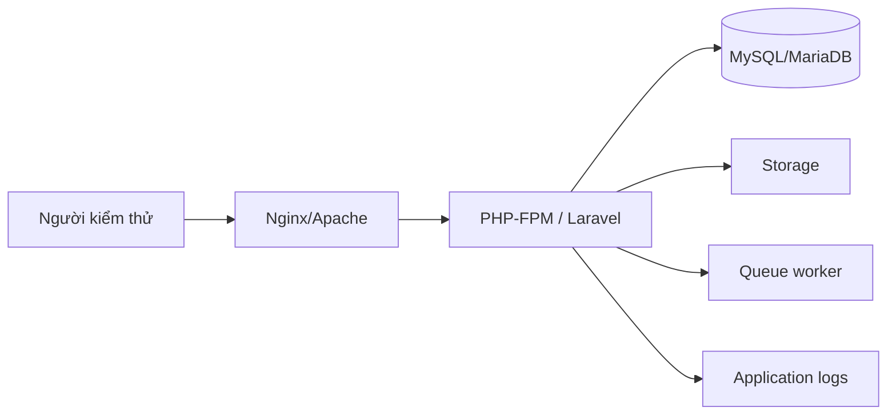

# Thiết lập môi trường Development và Staging

> Hạng mục: Thiết lập Development, Staging, Git repository và quy trình CI/CD  
> Phiên bản tài liệu: 1.0

## 1. Mục tiêu

Chuẩn hóa cách cài đặt, chạy, kiểm thử và triển khai VCA Portal CMS trên môi trường Development và Staging. Quy trình phải:

- Có thể tái lập từ repository.
- Không lưu credential trong mã nguồn.
- Đồng nhất version PHP, Composer, Node.js và database.
- Chạy migration, test và frontend build trước khi phát hành.
- Có health check và quy trình rollback rõ ràng.

Theo hồ sơ nghiệm thu, staging được đặt tại Viettel IDC. Repository không lưu IP, tài khoản SSH, private key hoặc thông tin mạng của máy chủ này.

## 2. Yêu cầu hệ thống

| Thành phần | Yêu cầu |
| --- | --- |
| PHP | 8.3 trở lên |
| Composer | Phiên bản tương thích Composer 2 |
| Node.js/npm | Phiên bản hỗ trợ Vite 8 |
| Web server | Nginx hoặc Apache, document root trỏ tới `public/` |
| Database | MySQL/MariaDB tương thích schema |
| PHP extension | Các extension Laravel yêu cầu, PDO MySQL, fileinfo, mbstring, openssl |
| File system | Quyền ghi cho `storage/` và `bootstrap/cache/` |

Version package được khóa bằng `composer.lock` và `package-lock.json`.

## 3. Cài đặt Development

### 3.1. Cài đặt tự động

Repository cung cấp Composer script:

```bash
composer setup
```

Script thực hiện:

1. `composer install`.
2. Tạo `.env` từ `.env.example` nếu chưa có.
3. Sinh `APP_KEY`.
4. Chạy migration.
5. Cài npm dependency.
6. Build frontend.

Lưu ý: không ghi đè `.env` đã tồn tại.

### 3.2. Cài đặt thủ công

```bash
composer install
cp .env.example .env
php artisan key:generate
php artisan migrate
npm install
npm run build
php artisan storage:link
```

Sau đó cập nhật giá trị trong `.env` local. Không commit file `.env`.

### 3.3. Chạy môi trường phát triển

```bash
composer dev
```

Lệnh này chạy đồng thời:

- Laravel development server.
- Queue listener.
- Laravel Pail để theo dõi log.
- Vite development server.

## 4. Nhóm cấu hình môi trường

| Nhóm | Biến tiêu biểu | Lưu ý |
| --- | --- | --- |
| Ứng dụng | `APP_NAME`, `APP_ENV`, `APP_KEY`, `APP_DEBUG`, `APP_URL` | Staging đặt `APP_DEBUG=false` |
| Ngôn ngữ | `APP_LOCALE`, `APP_FALLBACK_LOCALE` | Public locale còn được xác định từ host |
| Database | `DB_CONNECTION`, `DB_HOST`, `DB_PORT`, `DB_DATABASE`, `DB_USERNAME`, `DB_PASSWORD` | Credential lưu ngoài Git |
| Session | `SESSION_DRIVER`, `SESSION_DOMAIN`, `SESSION_LIFETIME` | Cần phù hợp domain staging |
| Storage | `FILESYSTEM_DISK` | Media service chủ động dùng disk `public` |
| Queue | `QUEUE_CONNECTION` | `.env.example` dùng database |
| Cache | `CACHE_STORE` | `.env.example` dùng database |
| Log | `LOG_CHANNEL`, `LOG_LEVEL` | Staging tránh log debug không cần thiết |
| Mail | `MAIL_*` | Mặc định local ghi log, không gửi mail thật |

## 5. Cấu trúc môi trường Staging



Yêu cầu cấu hình:

- Web root là thư mục `public`.
- HTTPS được bật cho domain staging.
- `storage` và `bootstrap/cache` có quyền ghi phù hợp.
- Có symbolic link public storage.
- Queue worker được quản lý bằng Supervisor/systemd hoặc công cụ tương đương nếu dùng queue.
- Cron chạy Laravel scheduler nếu sau này có scheduled task.
- Database và file upload có lịch backup.
- Health endpoint `/up` được dùng cho kiểm tra cơ bản.

## 6. Quy trình build và kiểm thử

### Backend

```bash
composer test
```

Tương đương với việc clear config test và chạy `php artisan test`.

### Frontend

```bash
npm run build
```

Build tạo manifest và asset production trong `public/build`.

Kết quả đối chiếu ngày 28/07/2026:

- 194 automated test đạt.
- 973 assertion đạt.
- Vite build thành công, 1.800 module được transform.

## 7. Quy trình triển khai Staging

```text
1. Xác định commit/tag cần triển khai
2. Sao lưu database và file upload
3. Lấy mã nguồn
4. Cài PHP dependency với chế độ production
5. Cài/build frontend dependency
6. Bật maintenance mode nếu cần
7. Chạy migration --force
8. Tạo storage link và kiểm tra permission
9. Clear/cache config, route, view
10. Restart PHP-FPM/queue worker
11. Kiểm tra /up và smoke test
12. Tắt maintenance mode
13. Theo dõi log sau triển khai
```

Các lệnh tham khảo:

```bash
composer install --no-dev --classmap-authoritative
npm ci
npm run build
php artisan down
php artisan migrate --force
php artisan storage:link
php artisan optimize
php artisan up
```

Lệnh cụ thể cần được điều chỉnh theo release tool và quyền trên máy chủ.

## 8. Hợp đồng pipeline CI/CD

Một pipeline cho repository này tối thiểu cần các stage:

| Stage | Nội dung | Điều kiện đạt |
| --- | --- | --- |
| Install backend | `composer install` | Dependency cài thành công |
| Install frontend | `npm ci` | Lock file hợp lệ |
| Test | `php artisan test` | Toàn bộ test đạt |
| Build | `npm run build` | Có manifest production |
| Package/release | Đóng gói source và asset | Artifact gắn với commit |
| Deploy staging | Migration, cache, restart | Health check và smoke test đạt |

Repository hiện không chứa workflow `.github`, GitLab CI, Jenkinsfile hoặc deployment script cụ thể. Vì vậy tài liệu xác nhận **quy trình và điều kiện pipeline**, không khẳng định một runner CI/CD cụ thể đang hoạt động. Cấu hình runner nếu có được quản lý tại hệ thống Git/DevOps bên ngoài.

## 9. Smoke test sau triển khai

1. Truy cập `/up`.
2. Mở trang chủ.
3. Đăng nhập `/admin/login`.
4. Mở danh sách Post, Page, Document, Media.
5. Tạo hoặc sửa một bản nháp kiểm thử.
6. Upload một file qua Media.
7. Kiểm tra tìm kiếm Admin.
8. Kiểm tra bài viết, văn bản và gallery public.
9. Kiểm tra một URL legacy `.html`.
10. Kiểm tra log không có lỗi mới.

## 10. Sao lưu và rollback

Trước release:

- Dump database có timestamp.
- Sao lưu `storage/app/public` và các thư mục file legacy.
- Ghi lại commit/tag đang chạy.
- Ghi danh sách migration mới.

Rollback ưu tiên:

1. Đưa code về release trước bằng cơ chế release directory/symlink.
2. Khôi phục database từ backup nếu migration hoặc import làm thay đổi dữ liệu không thể đảo ngược an toàn.
3. Khôi phục file upload nếu có thao tác file.
4. Chạy lại smoke test.

Không chạy `migrate:fresh`, xóa storage hoặc rollback hàng loạt trên staging/production khi chưa đánh giá dữ liệu.

## 11. Bảo mật vận hành

- Không commit `.env`, key hoặc credential.
- `APP_DEBUG=false` trên staging.
- Hạn chế SSH/database theo IP và nguyên tắc quyền tối thiểu.
- Bật HTTPS.
- Phân quyền file theo user chạy web server.
- Log không được ghi password, token hoặc nội dung nhạy cảm.
- Tài khoản kiểm thử phải được quản lý và thu hồi sau nghiệm thu.

## 12. Kết luận

Mã nguồn có đủ script cài đặt, test, build, migration và health check để triển khai theo quy trình chuẩn. Thông tin Viettel IDC và pipeline runner không nằm trong repository nhằm tránh lộ thông tin vận hành; các thông tin đó cần được bàn giao bằng hồ sơ hạ tầng bảo mật riêng.
