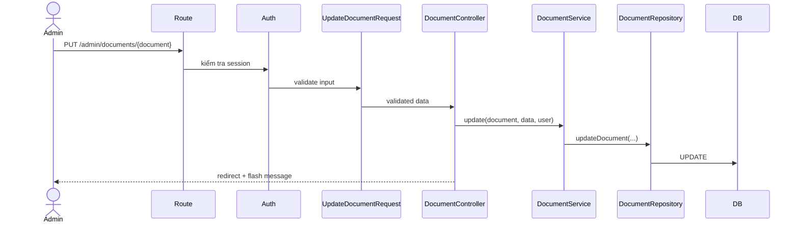

# Xây dựng Models, Controllers và Middleware

> Hạng mục: Xây dựng Models, Controllers, Middleware  
> Phiên bản tài liệu: 1.0

## 1. Mục tiêu

Hạng mục triển khai backend Laravel theo các trách nhiệm tách biệt:

- Model biểu diễn domain và quan hệ dữ liệu.
- Controller tiếp nhận request và trả response.
- Form Request validation dữ liệu quản trị.
- Service điều phối nghiệp vụ nhiều bước.
- Repository gom truy vấn, filter, search, pagination và persistence.
- Middleware bảo vệ khu vực quản trị và quản lý session web.

## 2. Tổng quan implementation

| Thành phần | Số lượng file | Vị trí |
| --- | ---: | --- |
| Eloquent Model | 9 | `app/Models` |
| Admin Controller | 13 | `app/Http/Controllers/Admin` |
| Public Controller | 8 | `app/Http/Controllers/PublicSite` |
| Form Request | 18 | `app/Http/Requests/Admin` |
| Service | 16 | `app/Services` |
| Repository | 10 | `app/Repositories` |
| Enum | 6 | `app/Enums` |

## 3. Eloquent Models

| Model | Bảng | Trách nhiệm chính |
| --- | --- | --- |
| `User` | `users` | Authentication, hồ sơ, tác giả nội dung |
| `Category` | `categories` | Chuyên mục cha/con và loại nội dung |
| `Post` | `posts` | Tin/bài viết, featured, thumbnail, tags |
| `Page` | `pages` | Trang tĩnh |
| `Document` | `documents` | Văn bản, cơ quan ban hành, file |
| `IssuingAgency` | `issuing_agencies` | Danh mục cơ quan ban hành |
| `Media` | `media` | Metadata và URL file |
| `Gallery` | `galleries` | Album, media mới và ảnh legacy |
| `Widget` | `widgets` | Khối nội dung theo vị trí hiển thị |

### 3.1. Relationship chính

- `User` có nhiều `Post`, `Document`.
- `Category` thuộc `User`, có `parent`, nhiều `children`, `Post`, `Document`, `Gallery`.
- `Post` thuộc `User`, `updater`, `Category`, `thumbnailMedia`.
- `Document` thuộc `User`, `updater`, `Category`, `IssuingAgency`, `fileMedia`.
- `Gallery` thuộc `User`, `updater`, `Category`, `coverMedia`.
- `Media` thuộc người upload.
- `Widget` thuộc người tạo và người cập nhật.

### 3.2. Cast và Enum

Các giá trị ổn định được cast sang PHP Enum:

- `PublicationStatus`: `draft`, `published`, `archived`.
- `CategoryType`: loại category.
- `DocumentGroup`: nhóm văn bản public.
- `WidgetPlacement`, `WidgetSlot`, `WidgetType`.

Ngày được cast sang `date`/`datetime`; boolean và JSON/array cũng được cast tại model.

### 3.3. Query scope

Model cung cấp scope dùng lại:

- `forLocale()`.
- `forStatus()`.
- `published()`.
- `featured()`.
- `active()`.
- `forType()`.
- `forPlacement()`, `forSlot()`, `ordered()`.

`published()` đảm bảo Public Website chỉ lấy nội dung đã xuất bản và đến thời điểm hiển thị.

### 3.4. Accessor tương thích dữ liệu cũ

- `Post::thumbnailUrl`: Media mới trước, legacy thumbnail sau.
- `Document::fileUrl`: Media mới trước, legacy file sau.
- `Gallery::coverUrl`: cover Media trước, ảnh legacy đầu tiên sau.
- `Category::coverUrl`: cover Media trước, legacy cover sau.

## 4. Controllers

### 4.1. Admin Controllers

Admin controller được tổ chức theo module:

```text
Auth/LoginController
DashboardController
CategoryController
DocumentController
GalleryController
IssuingAgencyController
MediaController
PageController
PostController
ProfileController
SearchController
UserController
WidgetController
```

Resource controller dùng các action quen thuộc:

| Action | Chức năng |
| --- | --- |
| `index` | Danh sách, filter, search, pagination |
| `create` | Form tạo mới |
| `store` | Validation và tạo record |
| `edit` | Form cập nhật |
| `update` | Validation và cập nhật |
| `destroy` | Soft delete hoặc xóa theo quy tắc module |
| `restore` | Khôi phục record đã xóa mềm |
| `forceDelete` | Xóa vĩnh viễn sau khi kiểm tra trạng thái |

Controller giữ mỏng: nhận dependency qua method/constructor injection, gọi Service và trả Blade view, redirect hoặc JSON.

### 4.2. Public Controllers

| Controller | Chức năng |
| --- | --- |
| `HomeController` | Trang chủ và các section động |
| `CategoryController` | Danh sách bài theo chuyên mục |
| `PostController` | Chi tiết bài viết |
| `PageController` | Trang tĩnh |
| `DocumentController` | Danh sách nhóm và chi tiết văn bản |
| `GalleryController` | Danh mục album và chi tiết gallery |
| `SearchController` | JSON gợi ý tìm kiếm |
| `LegacyRedirectController` | Chuyển URL `.html` cũ |

## 5. Form Request và Validation

Mỗi flow tạo/cập nhật chính có Form Request riêng. Validation kiểm tra:

- Trường bắt buộc, độ dài và kiểu dữ liệu.
- Unique slug theo phạm vi.
- Giá trị Enum hợp lệ.
- Category đúng type/locale.
- Media được chọn đúng loại.
- Điều kiện xuất bản, ví dụ gallery đã publish phải có ảnh.
- File upload đúng MIME/extension và tối đa 10 MB.

Ví dụ flow Post:

```text
StorePostRequest
  -> validate locale/status/category/thumbnail
  -> PostController
  -> PostService
  -> PostRepository
  -> Post model
```

## 6. Services

Service thực hiện:

- Chuẩn hóa input trước khi lưu.
- Gán `user_id`, `updated_by`, `translation_key`.
- Điều phối repository và rich content sanitizer.
- Giữ hoặc xóa đường dẫn legacy theo thao tác người dùng.
- Xử lý Media upload và xóa file vật lý khi force delete.
- Chuẩn bị dữ liệu cho form/view.
- Xây dựng payload và section cho Public Website.

Các service tiêu biểu:

- `PostService`, `PageService`, `DocumentService`.
- `CategoryService`, `GalleryService`, `WidgetService`.
- `MediaService`, `UserService`, `IssuingAgencyService`.
- `AdminSearchService`, `RichContentSanitizer`.
- Nhóm `Services/PublicSite`.

## 7. Repositories

Repository tách chi tiết truy vấn khỏi Controller/Service:

- Filter trạng thái, locale, category, loại và thùng rác.
- Eager loading relationship.
- Pagination.
- Thống kê danh sách quản trị.
- Tìm kiếm nội dung.
- Query public theo `published`, locale và thời điểm.
- CRUD persistence.

`BaseRepository` cung cấp thao tác chung; repository theo domain bổ sung query đặc thù.

## 8. Middleware và request lifecycle

`routes/admin.php` được đăng ký trong `bootstrap/app.php` với:

- Middleware group `web`.
- URI prefix `/admin`.
- Route name prefix `admin.`.

Nhóm route quản trị dùng:

- `guest` cho trang/login submit.
- `auth` cho dashboard, logout và toàn bộ resource quản trị.

Middleware `web` cung cấp session, cookie, CSRF và error sharing của Laravel. Ứng dụng cấu hình:

- Guest truy cập Admin được chuyển tới `admin.login`.
- User đã đăng nhập truy cập trang login được chuyển tới `admin.dashboard`.

Không có custom middleware riêng trong `app/Http/Middleware`; implementation hiện tận dụng middleware chuẩn Laravel.

## 9. Ví dụ request lifecycle

### Cập nhật văn bản



## 10. Error handling

- Validation lỗi trả về response chuẩn Laravel và error bag.
- Không tìm thấy record trả HTTP 404 qua route model binding/`abort`.
- Public service từ chối nội dung draft, sai locale hoặc sai category bằng 404.
- Upload storage thất bại ném `RuntimeException`.
- Flash message dùng component chung cho thành công/lỗi.

## 11. Kiểm thử

Feature test bao phủ:

- Login/logout và route protection.
- CRUD các module Admin.
- Soft delete, restore và force delete.
- Validation category/media/status.
- Public rendering và 404.
- Search và legacy redirect.

Tại ngày đối chiếu, toàn bộ 194 test và 973 assertion đạt.

## 12. Kết luận

Backend đã được tổ chức thành các layer có trách nhiệm rõ ràng, dùng đúng cơ chế Laravel cho model, request validation, controller, middleware, service và repository. Cấu trúc này hỗ trợ kiểm thử, bảo trì và mở rộng các module CMS mà không đưa nghiệp vụ phức tạp vào Controller hoặc Blade.
