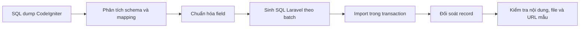

# Chuyển đổi dữ liệu CodeIgniter sang Laravel

> Hạng mục: Phân tích và xây dựng script chuyển đổi tin bài, ảnh và file từ CodeIgniter sang Laravel  
> Phiên bản tài liệu: 1.0  
> Ngày đối chiếu dữ liệu: 28/07/2026

## 1. Mục tiêu

Chuyển dữ liệu lịch sử từ schema CodeIgniter cũ sang schema Laravel mới, bảo toàn:

- ID cần thiết để truy vết.
- Nội dung và metadata chính.
- Quan hệ bài viết/chuyên mục và văn bản/danh mục.
- Trạng thái và thời điểm xuất bản.
- Đường dẫn ảnh, file và album cũ.
- Khả năng truy cập URL cũ.

## 2. Phạm vi dữ liệu nguồn

Các SQL dump nguồn nằm trong `data_files`:

| Nguồn CodeIgniter | Nội dung | Số record nguồn |
| --- | --- | ---: |
| `cms_viet_ci_articles_item.sql` | Tin bài | 20.924 |
| `cms_viet_ci_articles_category.sql` | Chuyên mục bài viết | 94 |
| `cms_viet_ci_vanban.sql` | Văn bản | 595 |
| `cms_viet_ci_loaivanban.sql` | Loại văn bản | 20 |
| `cms_viet_ci_coquanbanhanh.sql` | Cơ quan ban hành | 18 |
| `cms_viet_ci_picture_category.sql` | Chuyên mục thư viện ảnh | 9 |
| `cms_viet_ci_picture_item.sql` | Album | 12 |
| `cms_viet_ci_hinhanh.sql` | Ảnh trong album | 1.243 |

## 3. Script đầu ra

| Script | Bảng đích | Số record sinh ra |
| --- | --- | ---: |
| `posts/insert_posts.sql` | `posts` | 20.924 |
| `categories/insert_categories.sql` | `categories` type `post` | 93 |
| `documents/insert_documents.sql` | `documents` | 595 |
| `categories/insert_categories_document.sql` | `categories` type `document` | 20 |
| `issuing_agencies/insert_issuing_agencies.sql` | `issuing_agencies` | 18 |
| `categories/insert_categories_gallery.sql` | `categories` type `gallery` | 8 |
| `galleries/insert_galleries.sql` | `galleries` | 12 |

Chênh lệch 1 record ở category Post và Gallery là do record root `id = 1` được chủ động bỏ qua; các category nghiệp vụ còn lại được chuyển đổi.

## 4. Luồng chuyển đổi



## 5. Mapping bài viết

| Trường cũ | Trường mới/xử lý |
| --- | --- |
| `id` | Giữ tại `posts.id` |
| Tác giả/người sửa | `user_id`, `updated_by` |
| `parentid` | `category_id` |
| `title`, `sub_title` | Giữ nội dung |
| `slug` | `{old_slug}-a{old_id}` |
| Mô tả/nội dung | `excerpt`, `content` |
| Ảnh đại diện | `legacy_thumbnail_path` |
| `publish` | `published` hoặc `archived` |
| Ngày tạo | `published_at`, `created_at` |
| Lượt xem | `views` |
| Ngôn ngữ | Mặc định `vi` |
| Liên kết dịch | Sinh `translation_key` UUID |

Script chia batch 200 record để giảm kích thước một câu lệnh và dễ kiểm soát import.

## 6. Mapping văn bản

| Trường cũ | Trường mới/xử lý |
| --- | --- |
| `id` | Giữ tại `documents.id` |
| Số ký hiệu | `document_number` |
| Người ký | `signer_name` |
| Ngày ban hành | `issued_date` |
| Ngày hiệu lực | `date_of_validity` |
| Nhóm cũ | `document_group`: legal normative/administrative/party |
| Loại văn bản | `category_id` |
| Cơ quan ban hành | `issuing_agency_id` |
| File | `legacy_file_path` |
| Slug | `{slug-title}-vb{id}` |
| Trạng thái | `published` |
| Ngôn ngữ | `vi` |

Xử lý đặc biệt:

- Slug văn bản có thể dài nên migration đổi `documents.slug` sang `TEXT`.
- Ngày typo năm `0208` được chuẩn hóa thành `2018`.
- Zero date ở `updated_at` được thay bằng `created_at`.
- `translation_key` được sinh cho từng record.

## 7. Mapping thư viện ảnh

### Category gallery

- Bỏ category root.
- Tạo ID mới từ 147 để không xung đột category hiện có.
- Giữ ID cũ trong suffix slug: `{slug}-album{old_id}`.
- Ảnh bìa cũ lưu ở `legacy_cover_path`.

### Album

- Giữ ID album cũ tại `galleries.id`.
- Slug: `{slug-title}-albuma{old_id}`.
- Map category cũ sang category gallery mới.
- Gom các record `cms_viet_ci_hinhanh` theo album.
- Lưu danh sách đường dẫn vào JSON `legacy_image_paths`.
- `cover_media_id` và `media_ids` để `NULL` cho tới khi file được đưa vào Media Library.
- `publish = 1` thành `published`; ngược lại thành `archived`.

## 8. Bảo toàn file và ảnh

Thiết kế sử dụng hai tầng:

1. **Media mới**: file được upload vào Laravel Storage và tham chiếu bằng `*_media_id`.
2. **Legacy fallback**: giữ đường dẫn cũ khi file chưa được chuyển vào Media.

Thứ tự hiển thị:

```text
Media record có tồn tại?
  -> Có: dùng URL Laravel Storage
  -> Không: dùng legacy path
```

Các trường fallback:

- `posts.legacy_thumbnail_path`.
- `documents.legacy_file_path`.
- `categories.legacy_cover_path`.
- `galleries.legacy_image_paths`.

Điều này bảo toàn tham chiếu nội dung trong database. Tuy nhiên, file vật lý phải được đồng bộ từ máy chủ cũ sang staging/production và đối soát riêng; chỉ có đường dẫn trong SQL không chứng minh file thực tế còn tồn tại.

## 9. Tương thích URL cũ

Route:

```text
GET /{slug}.html
```

được xử lý bởi `LegacyRedirectController` và `PublicContentService`.

Hệ thống xác định slug cũ thuộc:

- Post.
- Page.
- Document.
- Nhóm văn bản.
- Một số URL tĩnh legacy.

Sau đó redirect đến route mới có tên rõ ràng. Feature test kiểm tra các trường hợp redirect chính.

## 10. Thứ tự import đề xuất

```text
1. Chạy Laravel migration
2. Đảm bảo user ID tham chiếu đã tồn tại
3. Import issuing_agencies
4. Import document categories
5. Import post categories
6. Import gallery categories
7. Import posts
8. Import documents
9. Import galleries
10. Đồng bộ file/ảnh legacy
11. Đối soát
12. Smoke test Admin/Public
```

Mỗi file SQL dùng transaction. Cần import trên database backup/rehearsal trước khi chạy staging chính thức.

## 11. Đối soát dữ liệu

### Record count

| Nhóm | Nguồn | Đích dự kiến |
| --- | ---: | ---: |
| Bài viết | 20.924 | 20.924 |
| Văn bản | 595 | 595 |
| Loại văn bản | 20 | 20 |
| Cơ quan ban hành | 18 | 18 |
| Album | 12 | 12 |
| Ảnh nguồn | 1.243 | Được gom theo album trong `legacy_image_paths` |

### Query kiểm tra tham khảo

```sql
SELECT COUNT(*) FROM posts;
SELECT COUNT(*) FROM documents;
SELECT COUNT(*) FROM issuing_agencies;
SELECT COUNT(*) FROM galleries;

SELECT COUNT(*) FROM posts WHERE category_id IS NULL;
SELECT COUNT(*) FROM documents WHERE issuing_agency_id IS NULL;
SELECT COUNT(*) FROM posts WHERE legacy_thumbnail_path IS NOT NULL;
SELECT COUNT(*) FROM documents WHERE legacy_file_path IS NOT NULL;
```

### Kiểm tra mẫu

Mỗi nhóm cần lấy mẫu:

- Record đầu, giữa, cuối.
- Nội dung có HTML dài và ký tự tiếng Việt.
- Bài published và archived.
- Văn bản có file.
- Album có nhiều ảnh.
- Đường dẫn local và URL tuyệt đối.
- URL cũ redirect đúng.

## 12. Tiêu chí “bảo toàn 100%”

Chỉ xác nhận bảo toàn hoàn chỉnh sau khi cùng đạt:

1. Record count đúng theo quy tắc loại trừ đã chốt.
2. Không mất trường nghiệp vụ bắt buộc.
3. Quan hệ category, user, cơ quan ban hành hợp lệ.
4. Nội dung HTML và tiếng Việt hiển thị đúng.
5. Mọi file/ảnh legacy trong phạm vi bàn giao tồn tại hoặc có báo cáo ngoại lệ được chấp thuận.
6. URL cũ quan trọng redirect đúng.
7. Bên A kiểm tra mẫu và xác nhận.

Repository hiện chứng minh được bộ SQL chuyển đổi, parity record chính và cơ chế legacy fallback. Việc file vật lý tồn tại 100% cần báo cáo đối soát trên máy chủ staging, không thể suy ra chỉ từ mã nguồn.

## 13. Rollback

- Backup database trước import.
- Không chạy lại script nếu chưa kiểm tra xung đột primary key.
- Khi import lỗi trong transaction, rollback transaction tương ứng.
- Nếu đã import nhiều nhóm và cần làm lại, ưu tiên khôi phục database từ backup rehearsal thay vì xóa thủ công.
- File vật lý chỉ copy, không xóa nguồn trong quá trình chuyển đổi.

## 14. Bằng chứng kiểm thử

Automated test kiểm tra:

- Post thumbnail fallback.
- Document file fallback và ưu tiên Media mới.
- Gallery legacy images và cover fallback.
- Giữ legacy path khi cập nhật nếu người dùng không thay file.
- Xóa legacy path khi Media mới được chọn.
- Public rendering và legacy URL redirect.

## 15. Kết luận

Bộ dữ liệu và SQL chuyển đổi bao phủ bài viết, văn bản, category, cơ quan ban hành, album và ảnh. Kiến trúc fallback cho phép dữ liệu cũ hoạt động song song với Media mới. Để ký xác nhận bảo toàn toàn bộ file, cần thêm kết quả kiểm kê file vật lý trên staging và biên bản đối soát của Bên A.
